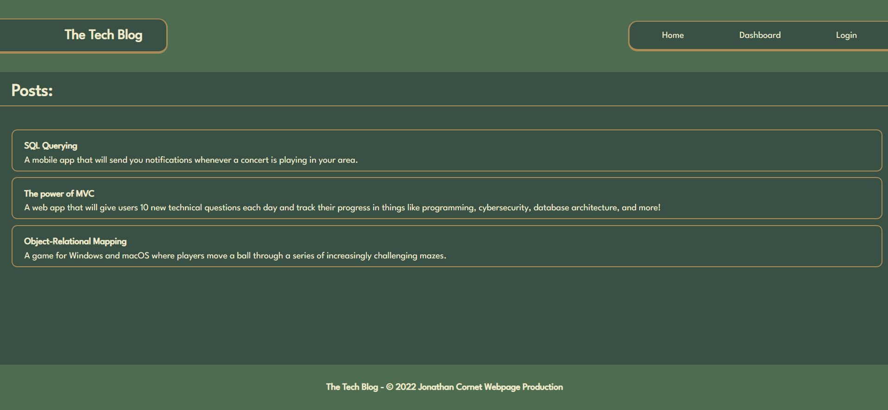
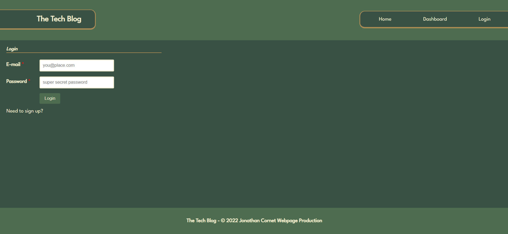

# Tech Blog Designed With MVC


## User Story

```md
AS A developer who writes about tech
I WANT a CMS-style blog site
SO THAT I can publish articles, blog posts, and my thoughts and opinions
```

## Description

This application is a tech blog that follows the MVC architectural/design pattern. A user is able to see all posts made by other users. They can also create or log into an account. If they log into their account and have post history, they can see it in their dashboard. Furthermore, they can edit old posts and leave a comment on any post when logged in. The program is designed using the Model-View-Controller design pattern. This application also meets the following acceptance criteria:

```md
GIVEN a CMS-style blog site
WHEN I visit the site for the first time
THEN I am presented with the homepage, which includes existing blog posts if any have been posted; navigation links for the homepage and the dashboard; and the option to log in
WHEN I click on the homepage option
THEN I am taken to the homepage
WHEN I click on any other links in the navigation
THEN I am prompted to either sign up or sign in
WHEN I choose to sign up
THEN I am prompted to create a username and password
WHEN I click on the sign-up button
THEN my user credentials are saved and I am logged into the site
WHEN I revisit the site at a later time and choose to sign in
THEN I am prompted to enter my username and password
WHEN I am signed in to the site
THEN I see navigation links for the homepage, the dashboard, and the option to log out
WHEN I click on the homepage option in the navigation
THEN I am taken to the homepage and presented with existing blog posts that include the post title and the date created
WHEN I click on an existing blog post
THEN I am presented with the post title, contents, post creator’s username, and date created for that post and have the option to leave a comment
WHEN I enter a comment and click on the submit button while signed in
THEN the comment is saved and the post is updated to display the comment, the comment creator’s username, and the date created
WHEN I click on the dashboard option in the navigation
THEN I am taken to the dashboard and presented with any blog posts I have already created and the option to add a new blog post
WHEN I click on the button to add a new blog post
THEN I am prompted to enter both a title and contents for my blog post
WHEN I click on the button to create a new blog post
THEN the title and contents of my post are saved and I am taken back to an updated dashboard with my new blog post
WHEN I click on one of my existing posts in the dashboard
THEN I am able to delete or update my post and taken back to an updated dashboard
WHEN I click on the logout option in the navigation
THEN I am signed out of the site
WHEN I am idle on the site for more than a set time
THEN I am able to view comments but I am prompted to log in again before I can add, update, or delete comments
```

The landing page looks as follows:



The signup page looks as follows:



The following link leads to a demonstration of the application being used:

Video of usage:

// TODO: VIDEO NEEDED HERE

## Table of Contents

- [Installation](#installation)
- [Usage](#usage)
- [Credits](#credits)
- [Contribute](#contribute)
- [Tests](#tests)
- [Questions](#questions)
- [License](#license)

## Installation

The following packages need to be installed in order to run the application:

Bcrypt: https://www.npmjs.com/package/bcrypt

Connect Session Sequelize: https://www.npmjs.com/package/connect-session-sequelize

Dotenv: https://www.npmjs.com/package/dotenv

Express: https://www.npmjs.com/package/express

Express Handlebars: https://www.npmjs.com/package/express-handlebars

Express Session: https://www.npmjs.com/package/express-session 

Node MySQL 2: https://www.npmjs.com/package/mysql2

Sequelize: https://www.npmjs.com/package/sequelize

These packages can be installed using the command:

```md
npm i
```

## Usage

This program can be downloaded and used by anyone. To run the application, use the following node and MySQL command:

First, open the MySql terminal and navigate to the db folder. Then run:

```md
SOURCE schema.sql;
```

Once the database has been created, seed and run the application by running the following commands:

```md
npm run seed
npm run start
```

Finally, the website can be viewed locally through localhost and the port option of 3001:

http://localhost:3001/

## Credits

This following packages are credited with helping create this application:

Bcrypt is used for hashing passwords: https://www.npmjs.com/package/bcrypt

Connect Session Sequelize allows session data to be stored in a SQL using sequelize: https://www.npmjs.com/package/connect-session-sequelize

Dotenv is used for loading environment configuration variables: https://www.npmjs.com/package/dotenv

Express is used as a web routing framework: https://www.npmjs.com/package/express

Express Handlebars allows the Handlebars view engine to work with express: https://www.npmjs.com/package/express-handlebars

Express Session allows express to utilize session data: https://www.npmjs.com/package/express-session 

Node MySQL 2 is used for connecting with and querying the database: https://www.npmjs.com/package/mysql2

Sequelize is used for formatting data and sending it to the SQL database: https://www.npmjs.com/package/sequelize

## Contribute

This is a completed application and does not need any contributions.

## Tests

There is no testing for this application.

## Questions

Feel free to reach out to me with questions:

Find my GitHub at: [GitHub Profile](https://github.com/cornetj13)

Email me at: cornetj2@gmail.com

## License

This source code is licensed under the MIT license found in the LICENSE file in the root directory of this source tree.